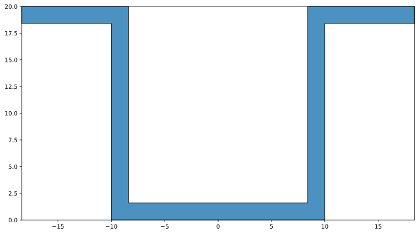

# pysectprop

Python Section Property Calculator

Section properties can be calculated used and displayed from standard section geometry inputs.

Example - Omega Section - test_omegasection.py:

``` python
#%%
# Import Dependencies
from IPython.display import display
from pysectprop.extruded import OmegaSection

#%%
# Create Section
omsect = OmegaSection(20.0, 1.6, 20.0, 1.6, 10.0, 1.6, rf=0.0, rl=0.0)

#%%
# Display Section Properties
display(omsect)

#%%
# Plot Section
ax = omsect.plot()
```

Output:

### Omega-Section

| h<sub>w</sub> (mm) | t<sub>w</sub> (mm) | w<sub>f</sub> (mm) | t<sub>f</sub> (mm) | w<sub>l</sub> (mm) | t<sub>l</sub> (mm) | r<sub>f</sub> (mm) | r<sub>l</sub> (mm) |
| :----------------: | :----------------: | :----------------: | :----------------: | :----------------: | :----------------: | :----------------: | :----------------: |
|               20.0 |                1.6 |               20.0 |                1.6 |               10.0 |                1.6 |                0.0 |                0.0 |

| A (mm<sup>2</sup>) | Ay (mm<sup>3</sup>) | Az (mm<sup>3</sup>) | c<sub>y</sub> (mm) | c<sub>z</sub> (mm) | Ayy (mm<sup>4</sup>) | Azz (mm<sup>4</sup>) | Ayz (mm<sup>4</sup>) |
| :----------------: | :-----------------: | :-----------------: | :----------------: | :----------------: | :------------------: | :------------------: | :------------------: |
|              117.8 |                   0 |                1178 |                0.0 |               10.0 |                11641 |                18471 |                    0 |

| I<sub>yy</sub> (mm<sup>4</sup>) | I<sub>zz</sub> (mm<sup>4</sup>) | I<sub>yz</sub> (mm<sup>4</sup>) | &theta;<sub>p</sub> (&deg;) | I<sub>yp</sub> (mm<sup>4</sup>) | I<sub>zp</sub> (mm<sup>4</sup>) |
| :-----------------------------: | :-----------------------------: | :-----------------------------: | :-------------------------: | :-----------------------------: | :-----------------------------: |
|                            6695 |                           11641 |                               0 |                         0.0 |                            6695 |                           11641 |


